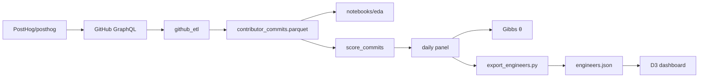

# posthog_contributor_impact

Take-home for the **Founding ML Engineer** role at Weave. The assignment is the last 90 days of [`PostHog/posthog`](https://github.com/PostHog/posthog) GitHub activity: a typed extract, EDA, a heuristic commit-impact score, a hierarchical model of contributor means, and a dashboard.

**Dashboard:** [https://posthog-contributor-impact-404453357872.us-central1.run.app](https://posthog-contributor-impact-404453357872.us-central1.run.app)

---

## Data flow

Notebooks and the Gibbs fit are a lab path. The live dashboard reads expanding-window means from the same panel, not posterior θ.

---

## Components

- **[`github_etl/`](github_etl/)** — GraphQL extract of default-branch (`master`) commits. One row per landed squash SHA, joined to PR and closing-issue fields. Writes `github_etl/data/contributor_commits.parquet` (gitignored).
- **[`notebooks/`](notebooks/)** — EDA, score diagnostics, and Gibbs traces on the real extract. Not a required hop for the dashboard.
- **[`model/`](model/)** — Per-commit impact heuristic `y`, expanding-window sufficient statistics, and Hoff Chapter 8 Gibbs sampler for contributor means θ. Spec in [`model/README.md`](model/README.md).
- **[`app/`](app/)** — Static D3 dashboard (nginx, Cloud Run). `export_engineers.py` bakes expanding-window means into `public/data/engineers.json`.
