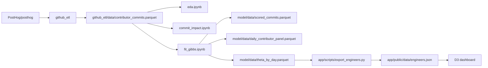

# notebooks

Lab path from the GitHub extract to the dashboard. Run from this directory (`uv sync`, kernel `notebooks/.venv`).

`eda.ipynb` and `commit_impact.ipynb` only read the ETL table. Scoring and the daily panel are written by `fit_gibbs.ipynb` if those files are missing. `export_engineers.py` is not a notebook; it is the handoff into the web app.

| Step | Artifact |
| --- | --- |
| `github_etl` | `github_etl/data/contributor_commits.parquet` (also writes `pull_requests.parquet`, `issues.parquet`) |
| `eda.ipynb` | none |
| `commit_impact.ipynb` | none |
| `fit_gibbs.ipynb` | `model/data/scored_commits.parquet`, `model/data/daily_contributor_panel.parquet`, `model/data/theta_by_day.parquet` |
| `app/scripts/export_engineers.py` | `app/public/data/engineers.json` (dashboard input) |
